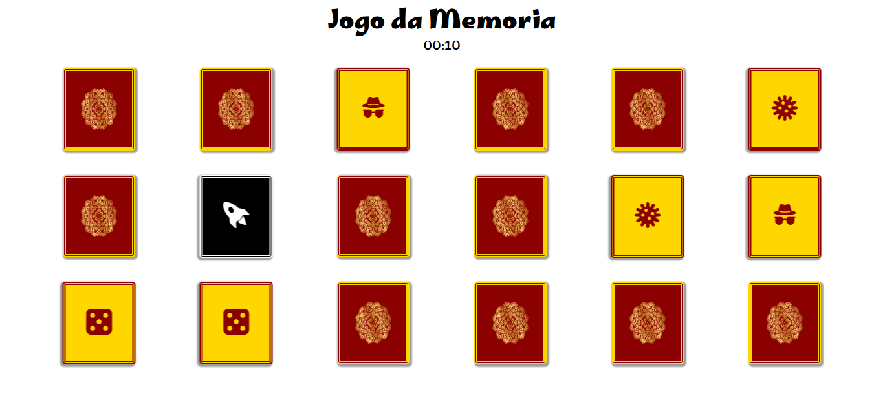

# Jogo da Memória

Um jogo da memória divertido e desafiador, desenvolvido com JavaScript, HTML e CSS! Que tal testar suas habilidade no modo desafio, heim ?



## Funcionalidades

- **Modo Clássico:** Jogue sem limite de tempo.
- **Modo Desafio:** Resolva o jogo antes que o tempo acabe.
- **Baralho embaralhado:** Cada partida tem uma distribuição diferente de cartas.
- **Feedback visual:** Animações e transições para melhorar a experiência do usuário.
- **Tela de vitória/derrota:** Mensagens exibidas ao final da partida, dependendo do resultado.

## Tecnologias Utilizadas

- **HTML5:** Estrutura do jogo.
- **CSS3:** Estilização e animações.
- **JavaScript:** Lógica de jogo e manipulação do DOM.

## Como Jogar
👉 <a href="https://jogo-da-memoria-delta-nine.vercel.app/" target="_blank">Clique aqui para jogar agora!</a>

1. Escolha entre **Modo Clássico** ou **Modo Desafio**.
   - **Modo Clássico:** Sem limite de tempo.
   - **Modo Desafio:** Resolva o jogo antes do tempo acabar.
2. Clique em uma carta para virá-la.
3. Encontre o par correspondente.
4. Continue até descobrir todas as cartas.
5. Ao final, veja sua performance e comece outra partida, se desejar!

## Como Rodar o Projeto

1. Clone este repositório:

   ```bash
   git clone https://github.com/jeffmazz/Jogo-da-Memoria.git
   ```

2. Abra o arquivo `index.html` em seu navegador.

3. Divirta-se!

## Contribuição

Fique à vontade para sugerir melhorias, reportar bugs ou criar pull requests.

1. Crie um fork do repositório.
2. Crie uma nova branch para suas alterações:

   ```bash
   git checkout -b minha-melhoria
   ```

3. Commit suas alterações:

   ```bash
   git commit -m "Adiciona nova funcionalidade"
   ```

4. Dê push para a branch:

   ```bash
   git push origin minha-melhoria
   ```

5. Abra um Pull Request.

## Licença

Este projeto está sob a licença MIT. Veja o arquivo [LICENSE](LICENSE) para mais detalhes.

---

Espero que você se divirta jogando e melhorando este projeto! <3
